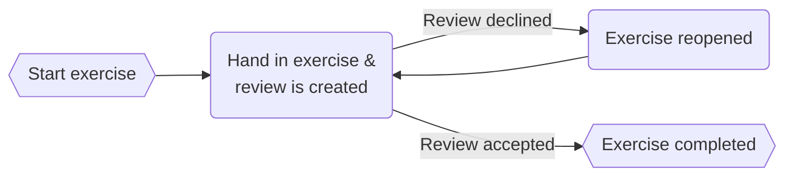

## Types of exercises

We have 3 different types of exercises:

- [Theory](introduction)
- [Practice](introduction)
- [Self Diagnostic](introduction#self-diagnostic)

## Handing in an exercise

Handing in an exercise can be done using one of the following: [file upload](#file-upload) or [Git](#git). Which one of
these is used, is defined in the exercise.

### File upload

When handing in an exercise using file upload, you will be prompted to provide the required files.

:::caution
Make sure the filenames of the required files and the files you are providing are the same.

This includes capital and non-capital characters, spaces, underscores, lines and file extensions.

If the required file was not found, it will be displayed under the 'Extra files' section. If this happens, double-check
the filename and file-extension and upload it again.
:::


### Git

When using [Git](https://git-scm.com/), you first have to have [Git](https://git-scm.com/) installed on your system.
After this you can clone the repository. The steps for cloning are at the top of
the exercise captioned with 'How do I start this exercise?'.

In short, you clone the exercise's repository by copying the clone url, and executing the following command in a
directory where you want it to be cloned.

```shell
git clone <REPLACE_THIS_WITH_YOUR_CLONE_URL>
```

After cloning the repository you have a new directory with the exercise name, and you can start creating your
implementation of the exercise.

#### Handing in the exercise

When you are done, and want to hand in the exercise, you need to
first stage all the changed files, commit the staged
changes, and finally push the commit. Jarvis will show the command if this
setting is enabled for your location.

```shell title="Staging the changed files"
git add --all
```

```shell title="Creating a commit"
git commit -m "Here you can add a commit message that describes the changes you made"
```

```shell title="Pushing the commit"
git push
```

After this you can press the hand in button on Jarvis.

## Exercise flow

This is the flow an exercise goes through in order to be completed. Below the flowchart is a description of every
step.



#### Handing in the exercise

After handing in the exercise, a review is created that either a student or a coach kan pick
up.

#### Review

A review can either be accepted and the exercise will be completed, or declined and the exercise will be reopened.


#### Exercise reopened

If the exercise was reopened because of a declined review, you have to fix the listed issues and hand the exercise in
again.


## Working ahead

By default, you can have a total of 7 exercises in review within a module. However, the maintainer of the module can
change this
number, so if you are not sure, you can ask the maintainer of the module.

For example when you have just [handed in](#handing-in-an-exercise) an exercise, it will be marked with 'In review'. You
can still move on to the next exercise and also hand it in. By default, you can do this up to 7 times, unless the
maintainer of the module has changed it.

